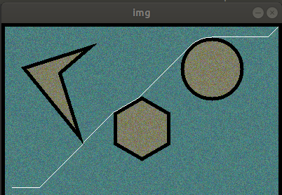

# This file contains path finding algorithm using Dijkstra algorithm for a point robot
The obstacle will be shown in dark shades and the final path will be highlighted in white
There is a clearance of 5mm from the obstacle and the outer rectangle and it will be highlighted in black

video link: https://drive.google.com/file/d/1AA5y7JwIchcDOtTIrHj47BOit2UM8hFm/view?usp=sharing

Libraries used:
cv2
numpy

[![Watch the video]](https://drive.google.com/file/d/1AA5y7JwIchcDOtTIrHj47BOit2UM8hFm/view?usp=sharing)

Steps to run the code
1. open the Dijkstra-pathplanning-Darshan-Jain.py file and run the file.
2. You will be prompted to input the goal and initial points in X-Y co-ordinates with origin in the bottom right till you enter the right co-ordinates
3. After entering the co-ordinates the path planner will find the path from start to end and will visualize the path using opencv.
4. After visualize and visualizing the path enter the ESC key to end the visualization.
