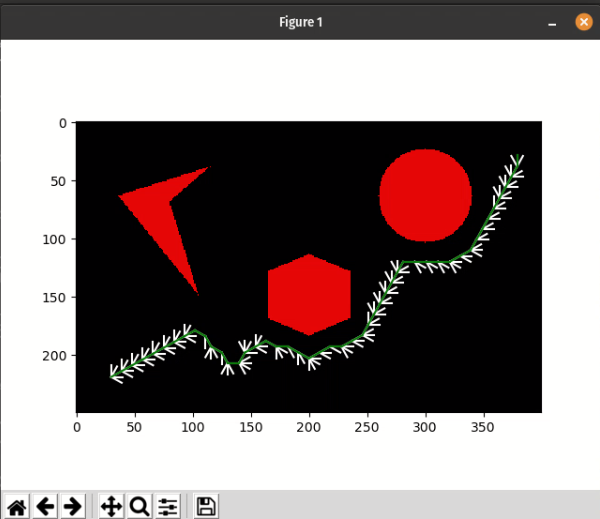

## A* Algorithm for rigid robot
_____________________________________________________________________________________________________________
# Author
Darshan Jain UID: 117454208
Rutvik Kevadiya UID: 
_____________________________________________________________________________________________________________

The obstacle will be shown in Blue color, the Explored node will be highlighted in white and the final path is highlighted in green color.
There is a clearance of 5mm and the robot radius is consireded as 10 mm from the obstacle and the outer rectangle and it will be in black.
_____________________________________________________________________________________________________________

Libraries used:
OpenCV
Matplotlib
Numpy
Heapqueue
math
time
python3.6.9
____________________________________________________________________________________________________________
Instructions to run the code:
1. Open the file DarshanJain.py and run the code
2. You will be asked to enter the start and the end node details till you enter valid details and also the step size.
3. Once you enter the details the code will run and generate the path and a visualization of the explored node window will pop up.
4. When a node is within the threshold distance from the goal node final path will be visualized in poped up window.
_____________________________________________________________________________________________________________

_____________________________________________________________________________________________________________

Video link: https://drive.google.com/drive/folders/1o7UuklHLKN-_3p9FJ7dp8UvL84KKXFlU?usp=sharing

